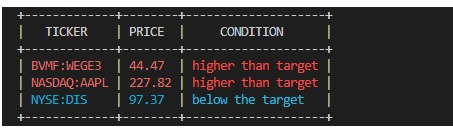

# FIC

FIC is a CLI application that allows you to set target prices to a stock and monitor if the current price is below or above the target. Currently, we followed the simplistic approach and we need to run a command to list the stocks. Later, we can extract the lib part and use it with other clients or even schedule a cron to run it everyday looking for opportunities.

## How it works

FIC is a CLI tool that uses google spreadsheet API as default provider to search for stocks and prices. Why use google spreadsheet api? Because in Brazil is one of very few ways to get this kind of data for free. We use the `GOOGLEFINANCE` function from it to get the data.

## How to run

- Configure a project and permissions to manage google spreadsheets programatically.
  - Go to the Google Cloud Console:
    - Visit [Google Cloud Console](https://console.cloud.google.com/).
  - Enable APIs and Services:
    - Navigate to the "APIs & Services" > "Library".
    - Search for "Google Sheets API", "Google Drive API" and enable it.
  - Create Service Account Credentials:
    - Go to "APIs & Services" > "Credentials".
    - Click on "Create Credentials" and select "Service Account".
    - Fill in the service account details (name, ID, description) and click "Create".
    - In the "Service account permissions" step, you can skip this for basic setup or assign appropriate roles if needed.
    - Click "Continue" and then "Done".
  - Generate the Key File:
    - After creating the service account, you will see it listed under the "Service Accounts" section.
    - Click on the service account you just created.
    - Go to the "Keys" tab.
    - Click "Add Key" > "Create new key".
    - Select "JSON" as the key type and click "Create".
    - A JSON file containing your service account key will be downloaded to your computer. This file is your credentials.json.
- Configure the application to run locally
  - Clone the repository
  - Set the credentials.json file you have downloaded to an env file.
    - `export CREDENTIAL=<path to your credentials.json>`
  - Create a new spreadsheet.
    - `go run ./cmd create <spreasheet_name>`
    - save the `id` of the spreadsheet created and export to an env variable
    - `export SPREADSHEET_ID=<spreadsheet_id>`
  - Add a new ticker and a target price (the ticker needs to have the stock market as sufix)
    - `go run ./cmd add BVMF:WEGE3 30.40`   -> add a monitor to the WEGE3 stock from brazilian stock market (BVMF) at the target price 30.40
    - `go run ./cmd add NASDAQ:AAPL 200.00`  -> add the Apple(AAPL) stock from NASDAQ at the target price 200.00
    - `go run ./cmd add NYSE:DIS 120.00`
  - Use the list command to monitor the target prices
    - `go run ./cmd list` -> will list only recommended stocks
    - `go run ./cmd list -a` -> will list all monitored stocks

## Comamnds

- `create <spreadsheet name>`            (create a new spreadsheet, returns the spreadsheet id)
- `grant-access <spreadsheetid> <email>` (in case you want to access the spreadsheet via browser)
- `delete <spreadsheetid>`               (delete the spreadsheet)
- `add <market:ticker> <target price>`   (add a new ticker to be monitored)
- `list [-a]`                            (list recomended monitored stocks, if -a flag is provided all the monitored stocks are returned)
